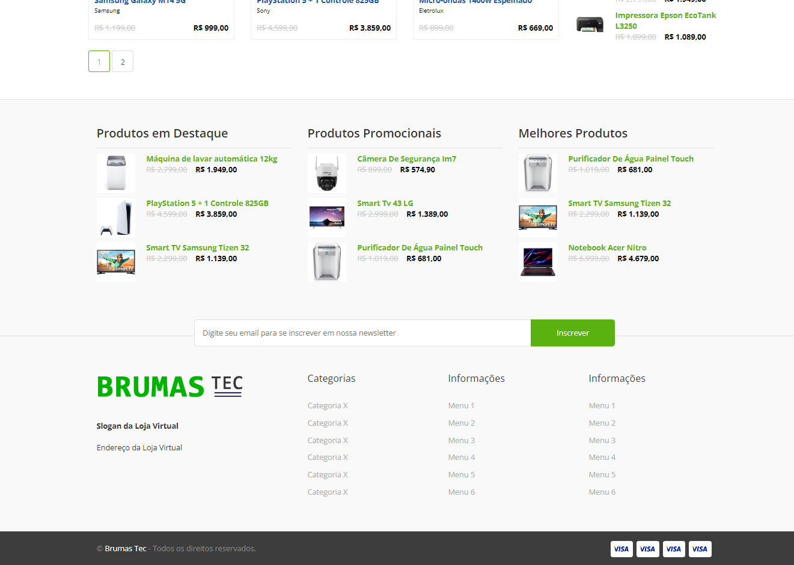

# Resumo:
O projeto foi feito utilizando POO e MVC, que consiste na construção de uma loja virtual com a utilização de algumas libs do composer, com o objetivo de treinar os conhecimentos adquiridos em php.

# Interface do Sistema:
Abaixo estão algumas screenshots de páginas da plataforma.

| Página Inicial - 1 |
| :- |
| *Listagem de todos os produtos, que podem ser filtrados por categorias (disponíveis ao lado da barra de pesquisa). Além disso, por meio do filtro lateral, é possivel refinar ainda mais os resultados, agrupando-os por marcas, preços, avaliações, promoções e outras opções.* |
 

 
 

| Página Inicial - 2 |
| :- |
| *Várias mini-listagens semelhantes a widgets e um campo para inscrição na newsletter, posicionados na parte inferior da página inicial.* |
 
